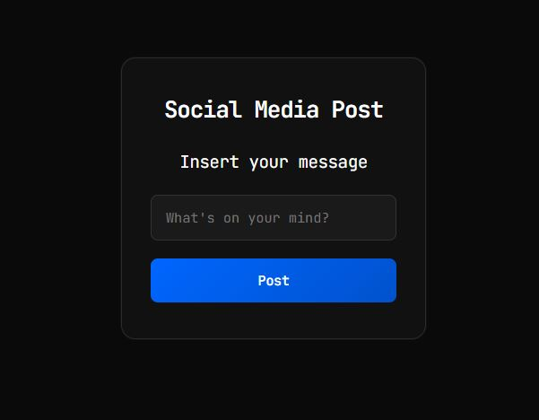

# README - Daily Coding Challenge

## 📋 Descripción del Proyecto

Este es el **Day One** de mi reto de codificación diario inspirado en freeCodeCamp. El proyecto consiste en una aplicación web minimalista que simula un validador de mensajes para redes sociales, clasificando los posts según su longitud.

## 📸 Vista previa de la aplicación

<p align="center">
  
</p>

## 🚀 Funcionalidad Principal

La aplicación permite a los usuarios:

- **Escribir mensajes** en un campo de texto
- **Validar la longitud** del mensaje al hacer clic en "Post"
- **Clasificar automáticamente** el mensaje en tres categorías:
  - **Short Post** (≤ 40 caracteres)
  - **Long Post** (41-80 caracteres)
  - **Invalid Post** (> 80 caracteres)
- **Feedback visual inmediato** con colores diferenciados
- **Mensajes temporales** que se autodestruyen después de 1 segundo

## 🛠️ Tecnologías Utilizadas

- **HTML5** - Estructura semántica
- **CSS3** - Estilos modernos con diseño dark theme
- **JavaScript ES6** - Lógica de validación e interacción
- **Google Fonts** - JetBrains Mono para tipografía tecnológica

## 📁 Estructura del Proyecto

```
DailyCodingChallenge/
│
├── DayOne/
│   ├── index.html          # Estructura principal
│   ├── styles.css          # Estilos minimalistas
│   └── script.js           # Lógica de validación
│
└── README.md              # Este archivo
```

## 🎯 Características Técnicas

### JavaScript

- Función `canPost()` que valida longitud de mensajes
- Manejo de eventos con `addEventListener`
- Manipulación del DOM en tiempo real
- Temporizadores con `setTimeout` para mensajes efímeros

### CSS

- Diseño **dark theme** con acentos azules
- Fuente monoespaciada para look tecnológico
- Efectos hover sutiles y transiciones suaves
- Diseño responsive y centrado

### HTML

- Estructura semántica limpia
- Input con placeholder descriptivo
- Feedback visual integrado

## 🔧 Cómo Usar

1. Clona o descarga el proyecto
2. Abre `index.html` en tu navegador
3. Escribe un mensaje en el campo de texto
4. Haz clic en "Post" para validar
5. Observa la clasificación automática
6. El mensaje de resultado desaparecerá en 1 segundo

## 🎨 Personalización

Puedes modificar fácilmente:

- **Límites de caracteres** en la función `canPost()`
- **Tiempo de visualización** cambiando los valores de `setTimeout`
- **Colores y estilos** en `styles.css`
- **Tipografía** importando otras fuentes de Google Fonts

## 📈 Próximos Pasos

Este es el primer día de mi challenge. Los siguientes días incluirán:

- Nuevos retos de JavaScript
- Funcionalidades más complejas
- Mejoras en la interfaz de usuario
- Integración con APIs
- Bases de datos simples

## 🌟 Objetivos del Reto

- ✅ Mantener consistencia en commits diarios
- ✅ Mejorar habilidades en HTML, CSS y JavaScript
- ✅ Crear un portafolio visible en GitHub
- ✅ Practicar resolución de problemas algorítmicos
- ✅ Desarrollar buenas prácticas de código

---

**💻 Desarrollado como parte del Daily Coding Challenge**  
_Día 1 - Validador de Posts para Redes Sociales_
